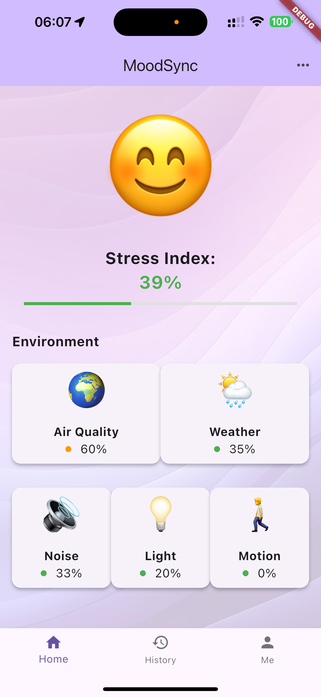
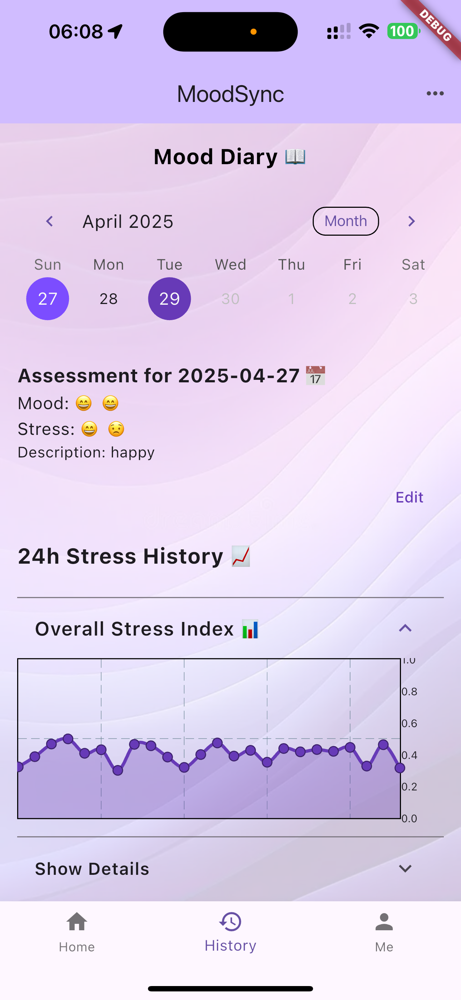
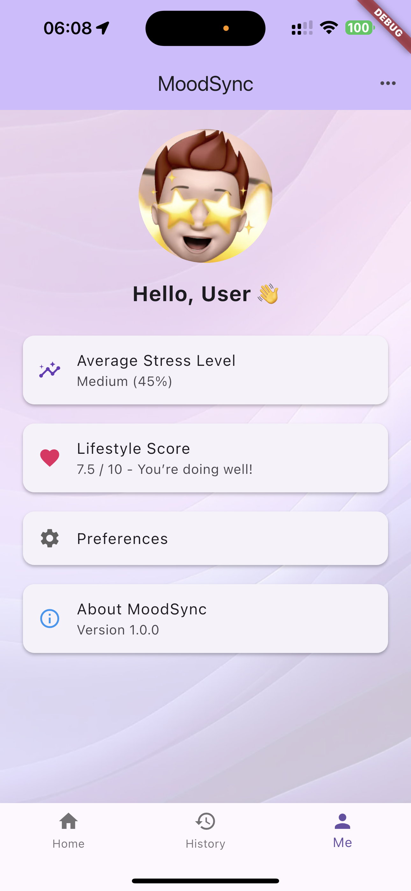

# 🚩 MoodSync

Welcome to **MoodSync** — a cross-platform Flutter app designed to help users visualize, understand, and manage their **stress and emotional well-being** in real time.

Built for the CASA0015 Final Assessment at UCL, this project reflects a journey of thoughtful design, real-time data integration, and emotion-aware interactivity.

---

## 📱 What is MoodSync?

**MoodSync** listens to your surroundings — ambient noise, air quality, temperature, light — and transforms them into a dynamic emotional mirror.  
Whether you're in a busy street or a quiet room, MoodSync helps you see how the **invisible world affects your inner world.**

### 🌟 Features:
- 🌡️ Real-time environmental monitoring (noise, air, light, humidity, ...)
- 😄 Dynamic emoji avatar that reflects your current stress index
- 📊 Visual trend analysis with charts and calendars
- ⚙️ Customizable preferences for visible indicators
- 🔄 Cloud synchronization via Firebase

[MoodSync Screenshot]
<p align="center">
  
  
  
</p>

🎥 **[Demo Video – Watch on GitHub](User demo.mp4)**  


---

## ⚙️ How to Install and Run

Make sure you have the latest Flutter SDK installed:

```bash
flutter doctor

Then:

git clone https://github.com/Felifann/casa0015-MoodSync.git
cd moodsync
flutter pub get
flutter run
```

## 📦 Dependencies Used:
firebase_core & cloud_firestore

geolocator, permission_handler

fl_chart, table_calendar

flutter_sensors

This app was developed using Flutter 3.x and is tested on Android 13 & iOS 16 simulators.

## 💡 Landing Page

You can also explore the project’s landing page here:
👉 casa0015-MoodSync/LandingPage


This project was created by Fan Xueyin

If you'd like to collaborate or contribute to MoodSync, feel free to reach out or fork the repo! 🤝

